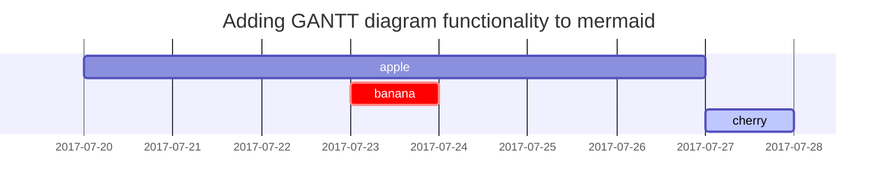

🏆 Hakathon 1등 수상 회고를 해보려고 한다.


# 대회소개
AWS와 함께 오뚜기사의 데이터와 Gen AI를 활용하여 Streamlit 또는 Cloud native App을 개발하는 해커톤으로, 일정은 2023년 9월 22일(금) ~ 9월 23일(토) 무박 2일로 진행되었다.
시상 내역은 아래와 같다.

    시상내역
    - 오뚜기 상(100만원)
    - Snow 상(50만원)
    - AWS 상(AWS Stock 팀원당 1주)
    - Slack 상(50만원)
    - 인기상(30만원)


<br>

## AWS 사전 교육 
>2023.09.16 13:30 ~ 18:00 (오프라인 - AWS 본사)

본격적으로 해커톤 진행에 앞서 AWS에서 Streamlit 핸즈온 세션을 열어주셨다.


Streamlit을 처음 접해본 나로써는 너무 좋은 기회였고, 대회를 진행함에도 수월함을 느꼈다. 
AWS에서의 이러한 철저한 교육과 배려에 너무 감사드린다...🫶


|                 |        |
|-----------------------|-----------------|
|||

AWS 본사 방문은 처음이라서, 너무 설레었다. 이 뷰를 visitor가 아닌 사원증을 매고 들어오고 싶다는 생각이 들었다. 동기부여 뿜뿜 🍀  <br>
세션을 통해서, <br>
AWS의 cloud9과 Lambda를 사용해 서버리스 크롤링을 진행하는 방법을 배웠다. 아직 클라우드 서비스에 대해 잘 모르는 클린이로써 입문에 많은 도움이 되었다!
간식도 엄청 많이 있었다... 특히 저 프레첼 과자가 진짜 너무 맛있었다..😋
<br>
<br>

-----
<br>

>###  💻 이렇게 사전 교육들을 거쳐서 본격적인 aws x 오뚜기 x Streamlit 해커톤이 시작되었다!


  우리 팀은 동기 5명으로 이뤄져 🍚 <span style="color:blue"> '뚜기두밥'</span> 이라는 팀명으로 활동했다.

나를 포함해 3명(유진이, 예은이)은 데이터 분석을 맡았고, 소영이와 서희언니는 각각 streamlit과 aws를 맡았다.


## 📊 데이터 소개
<p style="font-size:10px">(*데이터 파기 서약서로 인해 자세한 설명은 어렵다)</p>

  오뚜기 사에서 제공한 데이터셋으로 크게는 아래 2가지 데이터 셋으로 이뤄졌다.
  - >여러 seller에서 크롤링 된 오뚜기 상품에 대한 리뷰 데이터
  - >오뚜기 사의 재고 데이터

<br>

해커톤의 주제가 미리 공개되었던 만큼, 우리 팀은 사전 회의를 통해서 주제를 선정해두었던 상태였다. <br>사전에 준비한 아이디어는 바로

***
### "💡 해외 판매량 증대를 위한 리패키징 및 홍보 전략 제안 "

***
ㄴ 해외 마켓팅을 목적으로 해외 지역에서 유행하는 광고 형태를 학습해 이미지 생성AI로 콘티를 생성해주고, 함께 많이 팔리는 식품들을 새롭게 리패키징 하여 판매하는 것이다.

<br>

➡️ 대회 당일, 우리가 사전에 채택한 아이디어를 가지고 멘토님들께 피드백을 받았다. 그 결과.... 가슴에 칼이 꽂혔다... 🗡️
1. `신박한 아이디어가 아니다.`
2. 무박 2일이라는 `시간 내에 주어지지 않은 데이터를 구하는 것이 어려울 것`이다. 
   
<br>

## 🫨 해커톤을 진행하면서 겪었던 난항 : "아이디어 꼭지 잡기"

준비했던 아이디어가 혹평을 받으면서 팀원 모두 갈피를 잃었고,
오후 11시까지 아이디어 잡기에서 헤매다가, 멘토님께 좋은 충고를 받을 수 있었다.
### 아이디어 꼭지 잡기🎯
  >1.__해커톤은 짧은 시간동안 진행된다는 것을 인지하라.__
  {: .prompt-tip } 

  >2.__완전히 새로운 아이디어에 목 매지 마라.__
  {: .prompt-tip }
  
  >3.__어차피 하루안에 생각 못한다.__
  {: .prompt-tip }

  >4.__주어진 데이터 셋을 봐라.__
  {: .prompt-tip }

  >5.__⭐️⭐️⭐️ 데이터 셋을 통해 아이디어의 꼭지를 잡아라!!__
  {: .prompt-tip }

 완전히 새로운 것을 만들겠다는 생각에 사로잡혀 가장 기본이 되는 부분을 잊고 있었다.

 함께 밤새는 많은 멘토님들의 피드백을 기반으로 뚜기두밥의 최종 아이디어를 잡았다.


>### 💭 오뚜기 몰 활성화를 위한 캐치프라이즈 생성 서비스이다.
{: .prompt-warning }

제공받은 데이터셋을 분석한 결과, 오뚜기 몰은 다른 판매 플랫폼 쿠x 등에 비해 사용률이 매우 저조하다는 것을 알게되었다.
이 지점에서 꼭지를 잡아, `오뚜기 몰 활성화` 라는 주제 키워드를 얻었다.

특히나, 최근 자사몰이라고 불리는 `DC2`가 기업 마케팅의 주안점으로 자리잡고 있는 만큼 오뚜기 사를 위한 해커톤으로서의 주요 키포인트가 될 것이라고 생각했다.

## 개발물의 주요 기능 3가지
1. 리뷰 데이터를 이용해 사용자 맞춤형 광고 배너 제작, 재고 데이터를 이용해 빠른 재고 출고가 필요한 상품 광고 배너 상위 노출
      `* method: sentiment 감정 분석, 상관관계 분석 etc...`
2. 관리자용 모니터링 시스템 - 리뷰 데이터를 기반으로 부정적 데이터에 대한 상품 개선점 전달 및 수집 
      `* method: Streamlit을 통한 시각화 & Slack을 통한 데이터 전달`
3. 생성 AI를 활용한 홍보 캐치프라이즈 제작 
      `* method: Chat GPT4 프롬프트 엔지니어링 `

## 시스템 Architecture
>오뚜기 자사몰에 유저 리뷰 작성 ➡️ 쌓인 데이터를 aws lambda를 통해 크롤링 ➡️ aws rds에 저장 ➡️ 데이터 분석 ➡️ 정제된 데이터를 통해 aws cloud9상에서 streamlit으로 전송 ➡️ 자주 발생하는 negative 리뷰를 마케팅 담당자에게 slack으로 전달 ➡️ 개선점을 바탕으로 연구 ➡️ 상품 리뉴얼 ➡️ 개선점을 바탕으로 GPT가 홍보 문구 생성 ➡️ 오뚜기 자사몰 배너를 자동으로 업데이트하고, aws sns를 통해 해당 네거티브 리뷰 데이터를 작성한 사용자에게 자동으로 피드백 연락


이전까지 참여했던 여러 과제물들을 경험하면서, 시스템 아키텍쳐의 중요성에 대해 익히 느껴왔던 바 있었는데 이번 오뚜기 해커톤을 진행하면서 더욱 몸소 체감하였다. 


>###### 알잘딱깔센으로 만들어준 소영 최고! 이 아키텍쳐 덕분에 수상을 했다 해도 과언이 아니다~👍🏻


## 구현물 Demo


무박2일로 대회를 진행하면서 너무 힘들었지만...최종적으로 1등이라는 쾌거를 이뤄서 기억이 미화되었다. 떡진 머리와 맞바꾼 상 이랄까?


그리고 중간마다 넘치는 간식을 제공해주신 오뚜기와 AWS덕분에 배고픔이라는 걸 전혀 느끼지 못했다..🫶😋 각종 샌드위치와, 컵라면, 커피, 치킨과 주먹밥, 햄버거 까지 오히려 너무 많아서 다 못 먹었을 정도였다! 최고👍🏻

<br>

| 특히 오뚜기 측에서 보내주신 간식 차  |   노란 푸드트럭이 너무 귀엽고, 치킨과 주먹밥 👍🏻       |
|---------------------------------------------|-----------------|
|||

2등 발표가 날 때까지만 해도, 우리 팀 명이 불리지 않아 기대를 놓고 있었다. 다른 팀들의 구현물들도 충분히 완성도 있었고 매력적으로 다가왔기 때문이다. 
<br> 그래서 1등으로 호명되었을 때, 정말 놀랐다..ㅎㅎ

## 💬 대회를 통해 느낀점
이번 대회에서 배운점이 굉장히 많다. 앞선 글들에 전부 적혀있지만, 요약해 정리해보자!
>- 첫째, 해커톤에서는 주어진 데이터셋을 이용해 아이디어의 꼭지를 잡자.
{: .prompt-tip }
>- 둘째, 사공이 많으면 배가 산으로 간다. 따라서 다양한 피드백을 얻는 것도 중요하지만 초기에 내가 세팅한 틀이 있다면 우직하게 기본으로 가져가자.
{: .prompt-tip }
>- 셋째, 시스템 아키텍쳐와 워크플로우는 심사위원을 이해시키는 데 많은 도움을 준다. <br> ➡️ 사실 심사위원도 사람이기 때문에 발표의 모든 내용에 집중할 수 없다. 따라서 일목요연하게 정리해 설명하는 한 장의 페이지가 필요하다.
{: .prompt-tip }

<br>
오랜만에 참여한 무박 해커톤이었다. 그 동안은 대회의 운영진으로써 참여했던 기회가 더 많았어서, 직접 참여자가 되어보니 떨리기도 했고, 자극의 시간이 되기도 했다. <br> 이번 대회는 특히나, 오뚜기사 & Slack & AWS & Snowflake 이 외에도 정말 많은 분들이 멘토로써 함께 해주셨다. <br> 멘토 분들 덕분에 좋은 대회에서 값진 경험을 하며 진심어린 충고들과 멘토링을 받았다.
<br> 다시 한번 이 포스트를 통해 감사 인사를 드린다! 
<br> 


<!-- Quisque egestas convallis ipsum, ut sollicitudin risus tincidunt a. Maecenas interdum malesuada egestas. Duis consectetur porta risus, sit amet vulputate urna facilisis ac. Phasellus semper dui non purus ultrices sodales. Aliquam ante lorem, ornare a feugiat ac, finibus nec mauris. Vivamus ut tristique nisi. Sed vel leo vulputate, efficitur risus non, posuere mi. Nullam tincidunt bibendum rutrum. Proin commodo ornare sapien. Vivamus interdum diam sed sapien blandit, sit amet aliquam risus mattis. Nullam arcu turpis, mollis quis laoreet at, placerat id nibh. Suspendisse venenatis eros eros.


## Lists

### Ordered list

1. Firstly
2. Secondly
3. Thirdly

### Unordered list

- Chapter
  + Section
    * Paragraph

### ToDo list

- [ ] Job
  + [x] Step 1
  + [x] Step 2
  + [ ] Step 3

### Description list

Sun
: the star around which the earth orbits

Moon
: the natural satellite of the earth, visible by reflected light from the sun

## Block Quote

> This line shows the _block quote_.

## Prompts

> An example showing the `tip` type prompt.
{: .prompt-tip }

> An example showing the `info` type prompt.
{: .prompt-info }

> An example showing the `warning` type prompt.
{: .prompt-warning }

> An example showing the `danger` type prompt.
{: .prompt-danger }

## Tables

| Company                      | Contact          | Country |
|:-----------------------------|:-----------------|--------:|
| Alfreds Futterkiste          | Maria Anders     | Germany |
| Island Trading               | Helen Bennett    | UK      |
| Magazzini Alimentari Riuniti | Giovanni Rovelli | Italy   |

## Links

<http://127.0.0.1:4000>

## Footnote

Click the hook will locate the footnote[^footnote], and here is another footnote[^fn-nth-2].

## Inline code

This is an example of `Inline Code`.

## Filepath

Here is the `/path/to/the/file.extend`{: .filepath}.

## Code blocks

### Common

```
This is a common code snippet, without syntax highlight and line number.
```

### Specific Language

```bash
if [ $? -ne 0 ]; then
  echo "The command was not successful.";
  #do the needful / exit
fi;
```

### Specific filename

```sass
@import
  "colors/light-typography",
  "colors/dark-typography";
```
{: file='_sass/jekyll-theme-chirpy.scss'}

## Mathematics

The mathematics powered by [**MathJax**](https://www.mathjax.org/):

$$ \sum_{n=1}^\infty 1/n^2 = \frac{\pi^2}{6} $$

When $a \ne 0$, there are two solutions to $ax^2 + bx + c = 0$ and they are

$$ x = {-b \pm \sqrt{b^2-4ac} \over 2a} $$

## Mermaid SVG



## Images

### Default (with caption)

{: width="972" height="589" }
_Full screen width and center alignment_

### Left aligned

{: width="972" height="589" .w-75 .normal}

### Float to left

{: width="972" height="589" .w-50 .left}
Praesent maximus aliquam sapien. Sed vel neque in dolor pulvinar auctor. Maecenas pharetra, sem sit amet interdum posuere, tellus lacus eleifend magna, ac lobortis felis ipsum id sapien. Proin ornare rutrum metus, ac convallis diam volutpat sit amet. Phasellus volutpat, elit sit amet tincidunt mollis, felis mi scelerisque mauris, ut facilisis leo magna accumsan sapien. In rutrum vehicula nisl eget tempor. Nullam maximus ullamcorper libero non maximus. Integer ultricies velit id convallis varius. Praesent eu nisl eu urna finibus ultrices id nec ex. Mauris ac mattis quam. Fusce aliquam est nec sapien bibendum, vitae malesuada ligula condimentum.

### Float to right

{: width="972" height="589" .w-50 .right}
Praesent maximus aliquam sapien. Sed vel neque in dolor pulvinar auctor. Maecenas pharetra, sem sit amet interdum posuere, tellus lacus eleifend magna, ac lobortis felis ipsum id sapien. Proin ornare rutrum metus, ac convallis diam volutpat sit amet. Phasellus volutpat, elit sit amet tincidunt mollis, felis mi scelerisque mauris, ut facilisis leo magna accumsan sapien. In rutrum vehicula nisl eget tempor. Nullam maximus ullamcorper libero non maximus. Integer ultricies velit id convallis varius. Praesent eu nisl eu urna finibus ultrices id nec ex. Mauris ac mattis quam. Fusce aliquam est nec sapien bibendum, vitae malesuada ligula condimentum.

### Dark/Light mode & Shadow

The image below will toggle dark/light mode based on theme preference, notice it has shadows.

{: .light .w-75 .shadow .rounded-10 w='1212' h='668' }
{: .dark .w-75 .shadow .rounded-10 w='1212' h='668' }

## Video



## Reverse Footnote

[^footnote]: The footnote source
[^fn-nth-2]: The 2nd footnote source -->
